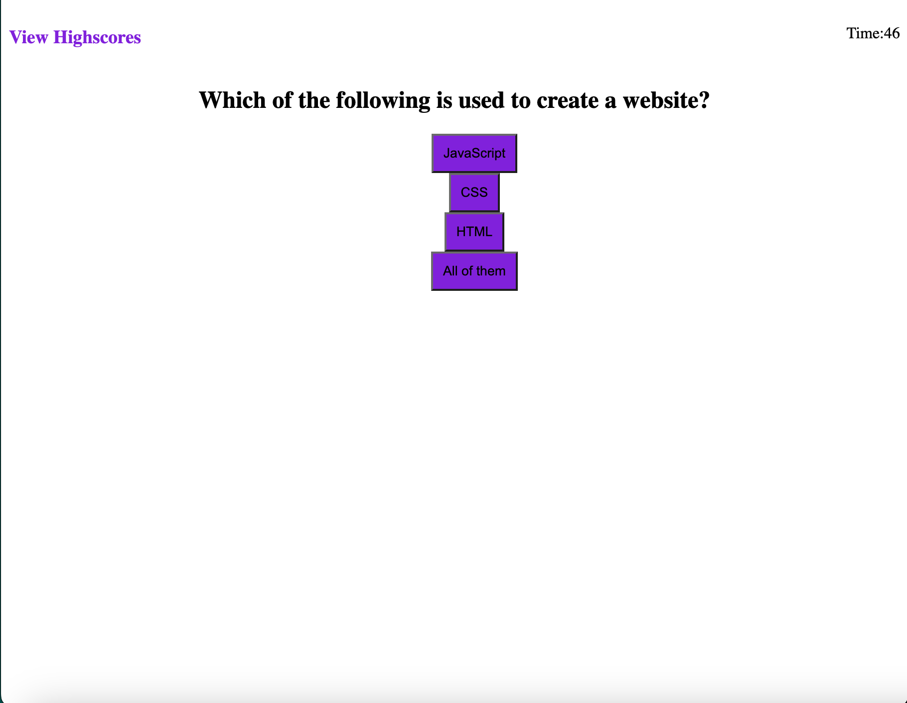

# <Challenge4-code-quiz>

## Description

Provide a short description explaining the what, why, and how of your project. Use the following questions as a guide:

- I just want to practice and get better at coding
- This is a coding quiz thats only 5 questions but it was mainly made for me to practice coding
- It allows students to learn
- I learned how to make a quiz. How to make pages dynamic.

## Usage

## Credits

UM Coding Bootcamp
W3 Schools

